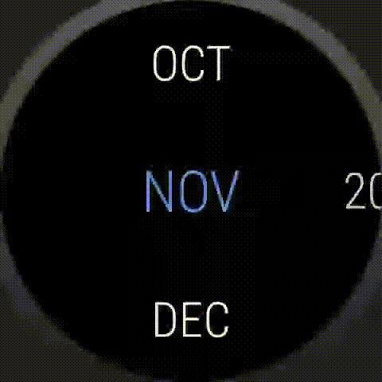
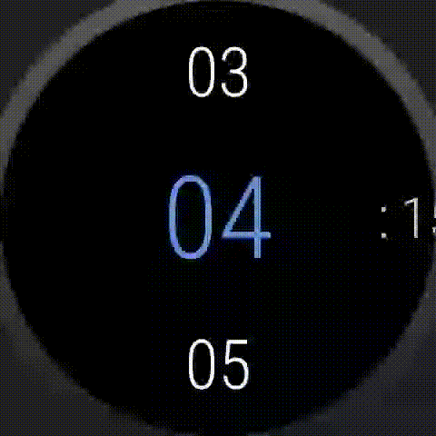
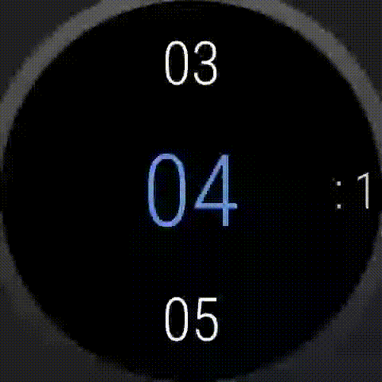

## WearDateTimePicker
DateTimePicker for Wear OS (from Wear OS Settings)

#### DatePicker
Original (Wear OS Settings)



Library


#### TimePicker
Original (Wear OS Settings)



Library



## Usage

#### Gradle (build.gradle)
````groovy
dependencies {
    implementation 'com.kimjio:weardatetimepicker:1.0'
}
````

#### Dialog
````java
//DatePicker
new DatePickerDialog(/* context */ this)
                .setOnDateSetListener(new DatePickerDialog.OnDateSetListener() {
                    @Override
                    public void onDateSet(DatePicker view, int year, int month, int dayOfMonth) {
                        //TODO date
                    }
                })
                .show();

//TimePicker
new TimePickerDialog(/* context */ this, /* 24 hours */ true)
                .setOnTimeSetListener(new TimePickerDialog.OnTimeSetListener() {
                    @Override
                    public void onTimeSet(TimePicker view, int hourOfDay, int minute) {
                        //TODO time
                    }
                })
                .show();
````

#### View
````xml
<layout>
    <!-- DatePicker -->
    <com.kimjio.wear.datetimepicker.widget.DatePicker
        android:layout_width="match_parent"
        android:layout_height="match_parent"/>
    
    <!-- TimePicker -->        
    <com.kimjio.wear.datetimepicker.widget.TimePicker
        android:layout_width="match_parent"
        android:layout_height="match_parent"/>
</layout>
````

#### TODO
WearableListView to WearableRecyclerView

xml attrs
